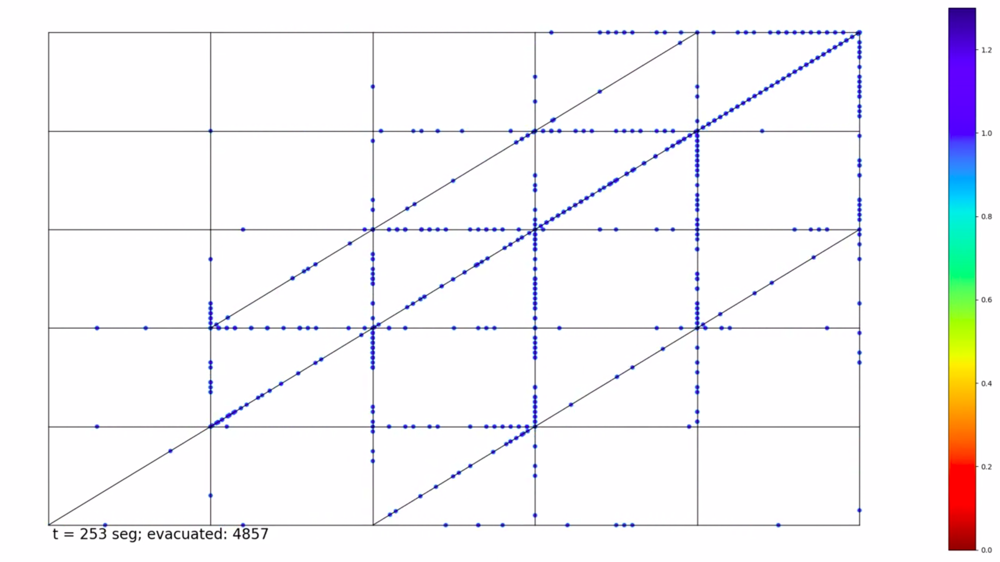

# ESCAPE



Puedes observar la simulación completa del caso Square [aquí](https://youtu.be/0RpVIt6iqHw).

# Installation

You can install Escape with the following command in the terminal:

``` bash
git clone https://github.com/juliocesar-ramirez/cplus-version.git
cd cplus-version
make
source bashrc
´´´
